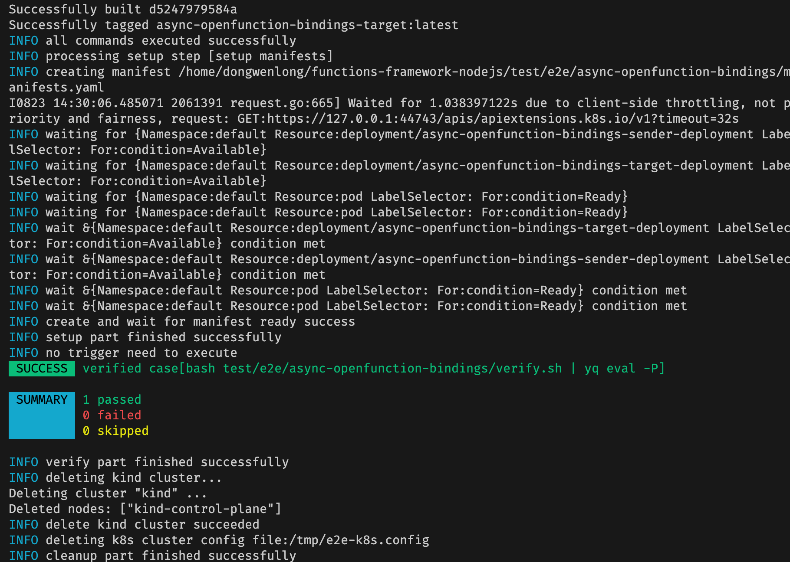
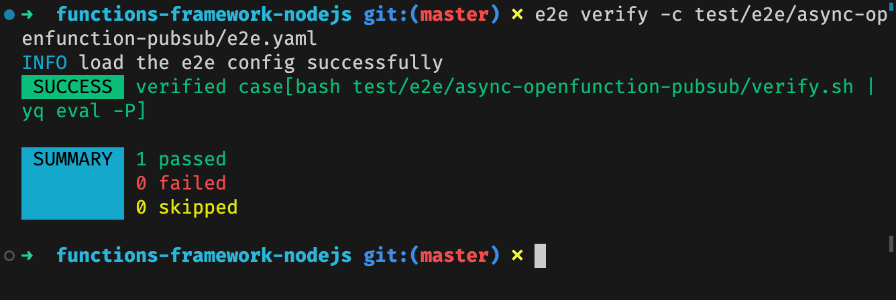

# E2E Test

In the context of E2E (End-to-End) testing, certain tests within the `.github/workflows/e2e.yaml` file cannot run using the provided machine configuration from GitHub Actions. However, these tests can be executed successfully locally. Below is a guide outlining the process to conduct local E2E tests.

## Preparations

### Kind

Kind (Kubernetes in Docker) is a Kubernetes incubation project. Kind is an out-of-the-box Kubernetes environment construction solution. As the name suggests, all the components required for Kubernetes are deployed in a Docker container, which can easily build Kubernetes cluster.

Official Documentation: https://kind.sigs.k8s.io/

**How to install?**

```Bash
# For AMD64 / x86_64
[ $(uname -m) = x86_64 ] && curl -Lo ./kind <https://kind.sigs.k8s.io/dl/v0.20.0/kind-linux-amd64>
# For ARM64
[ $(uname -m) = aarch64 ] && curl -Lo ./kind <https://kind.sigs.k8s.io/dl/v0.20.0/kind-linux-arm64>
chmod +x ./kind
sudo mv ./kind /usr/local/bin/kind
```

### Kubectl

Kind is only responsible for creating the cluster (this will create kubeconfig), and subsequent cluster operations require kubectl.

Official Documentation: https://kubernetes.io/docs/tasks/tools/install-kubectl-linux/

**How to install?**

```Bash
curl -LO "https://dl.k8s.io/release/$(curl -L -s https://dl.k8s.io/release/stable.txt)/bin/linux/amd64/kubectl"
chmod +x kubectl
sudo mv kubectl /usr/local/bin
```

### SkyWalking Infra E2E

SkyWalking Infra E2E is an End-to-End Testing framework that streamlines the setup, debugging, and validation of E2E tests.

Official Documentation: https://skywalking.apache.org/docs/skywalking-infra-e2e/next/readme/

**How to install?**

```bash
git clone https://github.com/apache/skywalking-infra-e2e.git
cd skywalking-infra-e2e
make build
```

Upon completion, the executable path for E2E tests is `bin/$PLATFORM/e2e`. You can relocate this to the `usr/local/bin` directory using the `move` command, enabling the use of the e2e command anywhere.


### Yq

Yq is a lightweight and portable command-line YAML processor.

Official Documentation: https://mikefarah.gitbook.io/yq/

**How to install?**

Download the binary package from the [GitHub repository](https://github.com/mikefarah/yq) and place it in the `/usr/local/bin` directory.


## How to run

For illustration purposes, let's consider the `async openfunction bindings e2e` test.

### Single Step Execution

Execute the following command:

```bash
e2e run -c test/e2e/async-openfunction-bindings/e2e.yaml
```


### Multi-Steps Execution

SkyWalking Infra E2E follows a multi-step approach for execution:


1. Prepare the environment for this test

```bash
e2e setup -c test/e2e/async-openfunction-bindings/e2e.yaml
```

2. Trigger the test (a script executes during test validation, so this step is unnecessary for this test):

```bash
e2e trigger -c test/e2e/async-openfunction-bindings/e2e.yaml
```

3. Verify this test

```bash
e2e verify -c test/e2e/async-openfunction-bindings/e2e.yaml
```

4. Clean up the test environment

```bash
e2e cleanup -c test/e2e/async-openfunction-bindings/e2e.yaml
```

When using the format `e2e setup -c **`, the generated Kubernetes configuration is located at `/tmp/e2e-k8s.config`.

The setup process involves multiple smaller steps. You can debug incrementally by following each sub-step, applying and rolling back files using `kubectl`. At any point, you can monitor the status of individual pods.

## Results
Here are the results of the E2E tests:

1. async openfunction bindings e2e test



2. async openfunction pubsub e2e test



3. knative openfunction state e2e test


